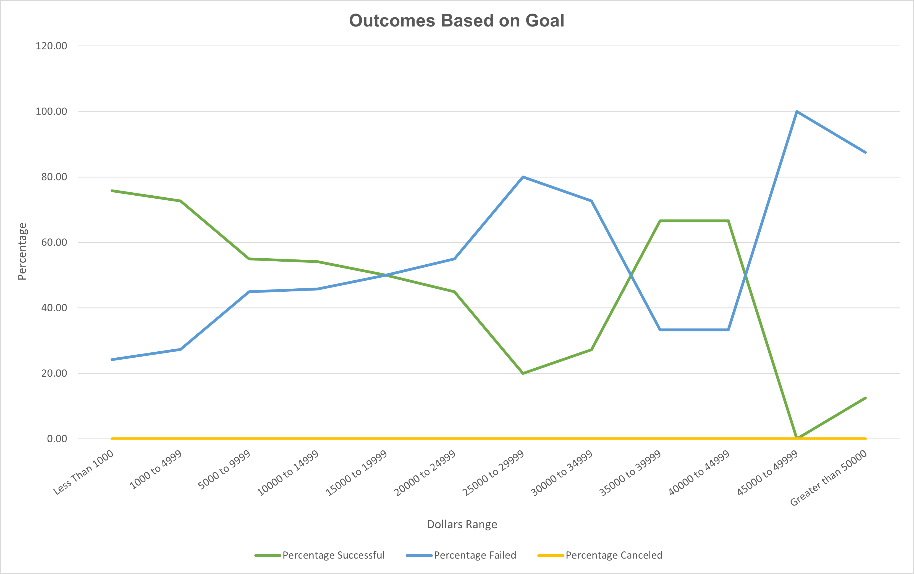

# Kickstarting with Excel
Module 1 Challenge 

## Overview of Project
In this project we use advanced functions of Excel to analyze crowdfunding data based on their launch date, on their fundraising goals, and various other aspect.
The purpose of this analysis is to give proper advice to Louise in order to help her launch a successful campaing for her next play.

## Analysis and Challenges
### Analysis of Outcomes Based on Launch Date
First, we made a Pivot Table and Pivot Chart looking at the Outcome based on Launch Date to find out if there was a time of the year where fundraiser have greater chance of success. Since Louise is interested in Plays, we filtered the category 'Theater' and subcategory 'Plays' for more accurate information. 

### Analysis of Outcomes Based on Goals

### Challenges and Difficulties Encountered
The date in the database was in Unix timestamp format, which counts the seconds since January 1st 1970, so we had to convert it to a readable format using a formula.  

## Results

- What are two conclusions you can draw about the Outcomes based on Launch Date?
- For all categories, the month of May is the best time to start a fundraiser and this is even more evident when looking at the Theater category alone.

- What can you conclude about the Outcomes based on Goals?

- What are some limitations of this dataset?

- What are some other possible tables and/or graphs that we could create?

