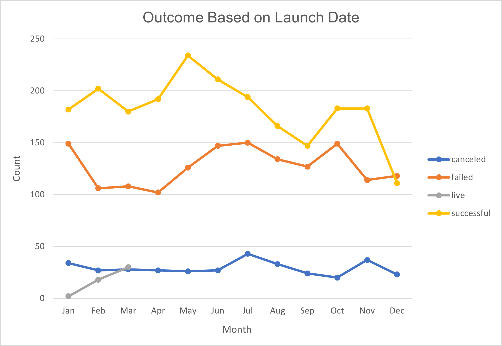

# Kickstarting with Excel
Module 1 Challenge 

## Overview of Project
In this project we used advanced functions of Excel to analyze crowdfunding data based on their launch date, their fundraising goals, and various other aspect.
The purpose of this analysis is to give advice to Louise in order to help her launch a successful campaing for her next play.

## Analysis and Challenges
### Analysis of Outcomes Based on Launch Date
First, we made a Pivot Table and Pivot Chart looking at the Outcome based on Launch Date to find out if there was a specific time of the year where fundraiser have greater chance of success. Since Louise is interested in Plays, we filtered for the category 'Theater' for more accurate information. 

### Analysis of Outcomes Based on Goals
Next, we used the function 'COUNTIFS' to organize the data by range of goals for the subcategory 'plays'. We calculate the percentage of successful, failed and canceled plays based on the total number of plays. This allows us to see if the amount needed to be raised may affect the outcome.

### Challenges and Difficulties Encountered
The date in the database was in Unix Timestamp format, which counts the number of seconds since January 1st 1970, so we had to convert it to a readable format using a formula that divides the number by 60 seconds, 60 minutes and 24 hours. This gives us the number of days to be added to Janauary 1st 1970 and then a date. The function 'COUNTIFS' was also a little bit tricky since two conditions were needed to get a range. There may be a way to COUNT the value if it is between 1000 > 4999 but in this analysis we counted greater than 1000 and separately counted <=4999.

## Results
The 'Outcome Based on launch' date graph for all categories, shows the month of May to be the best time of the year to start a fundraiser. March, April and June have similar spread between the successful and failed campaign and may also be good time. Closer to the end of the year the chance of getting a successful or failed campaign are almost 50/50 and would therefore not be recommended. When looking at the 'Theater Outcomes vs Launch' graph a similar more pronounced trend is observed. The month of May if again the best time to start a fundraiser while June and July may have good success rate as well. In both cases, the number of failed campaigns appears to be statistically flat so timing might have a big impact. 

When looking at the 'Outcomes vs goals' graph we can see that success rate is inversely proportional to the goal amount while failure is proportional. This makes sense since it is more difficult to raise big amount of money. There is a little flip of the curves between 35000$ and 45000$ but this may be due to the low sample size.

Beside the low sample size in some cases, other limitation  of this dataset is that the number of backers is sometimes very small despite the goal been reach. This could be due to a few rich close friends of the fundraising person contributing high amounts. Also important to note is that the past does not necessarily predicts the future. Economic downturn, such as recession or pandemic, are other factors that affects people's willingness to donate money.

For these reasons, other possible graph to explore would be to filter out the campaingns with less than 50 or 100 backers or those with very high average donation.
